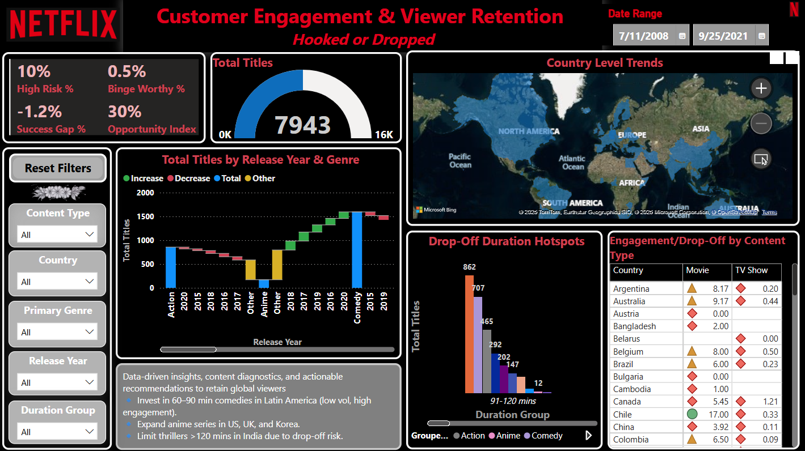

# Netflix Content Engagement & Viewer Retention: Hooked or Dropped

A Power BI storytelling project that explores **viewer engagement patterns, drop-off risks**, and **strategic content opportunities** across Netflix’s global catalog — based on genre, duration, and country trends.

This project merges **data analysis, visual storytelling, and business impact modeling** into an interactive Power BI dashboard and executive PDF report.

---

**Goal:**                                                                                                                                                                           

Discover patterns of viewer engagement, drop-offs, inefficiencies, and make powerful recommendations for Netflix - enabling them to make smarter, more audience-aligned content decisions.

---

**💡Project Objectives:**

- Identify which content types and durations lead to early viewer drop-off.
- Reveal high-engagement content zones across genres and countries.
- Measure production vs. engagement mismatch (Success Gap).
- Recommend where Netflix should invest more (or less) to improve retention.
- Present results through an executive-style dashboard & story-driven reporting.

---

**📊 Dataset:**       

Netflix dataset from Kaggle:                                                                                                                                                                                            
🔗 [Netflix Movies and TV Shows – Kaggle Link] (https://www.kaggle.com/datasets/shivamb/netflix-shows)                                                                                                           

---

## Report Structure & Page-by-Page Overview

**Page 1: Executive Overview (Dashboard Summary)**
- High-level view of total content, type share (% Movies, % TV Shows), and most common genres.
- KPI Cards: High Risk %, Binge Worthy %, Success Gap %, Opportunity Index.
- Slicers panel to dynamically filter by genre, country, release year, etc.

**Page 2: 📉 Drop-Off Risk & Duration Analysis**

📄 Purpose:                                                                                                                                      
Identify patterns where viewers stop watching early, based on:
- Content type
- Duration
- Genre
- Engagement trends

- Analyze drop-off patterns by Duration Group (0-60 mins, 121-240 mins, etc.).
- Highlights underperforming formats and risky engagement patterns
- Detect content categories with high drop-off risk.
- Recommend optimal content duration.
- Spot long vs. short bingeability.

**Page 3: Regional Content & Audience Insights**

📄 Purpose:                                                                                                                 
Show how Netflix content performs across countries/regions, including:
- Top content-producing countries.
- Regional differences in content type or genre.
- Engagement differences by region.
- Localized preferences (e.g., India: TV shows, US: Movies, etc.).

- View content trends and performance by country- Type preferences, genre popularity, average duration.
- Matrix visual showing genre vs country drop-off risk.

**Page 4: Strategic Content Opportunities & Viewer Recommendations**
- Drop-Off Hotspot Chart.
- Opportunity Matrix and Engagement Ratio.
- Strategic Action Summary. 

**Page 5: One-Page Executive Summary Dashboard**
- Compact view of KPIs, visuals, and strategic insight bullets. 

**Page 6: Strategic Storytelling & Business Impact Summary**
- Key insights and business impact modeling.
- Viewer uplift and revenue gain if strategy is adopted.

---

## 🔗 Live Power BI Dashboard

[📊 Click to View the Interactive Dashboard on Power BI Service](https://app.powerbi.com/groups/me/reports/a4f43e83-e8e5-41af-8559-6d2ab45f8669/1b73a65e46b9a9ac5dcc?experience=power-bi)

---

## 📄 PDF Summary Report

Netflix - Customer Engagement & Viewer Retention.pdf
Download it from the GitHub repo: https://github.com/SweetySeelam2/Netflix_Content_Engagement_Viewer_Retention

This 6-page report condenses the key insights, visuals, KPIs, and estimated business impact into an executive-style document.

---

## 📸 Dashboard Preview

---

## 📈 Key Insights

- 🔴 **29% of titles are in high drop-off segments** (e.g., >120 min thrillers, 1-season horrors).
- ✅ **60–90 min short-form comedies in Latin America** show 2–4× higher engagement with low production volume.
- ✅ **Anime in US, UK, and South Korea** shows high retention with low catalog coverage.
- ⚠️ **Crime, Horror, and Documentaries underperform** in some regions: India, Poland, Austria.

---

## 💡 Strategic Recommendations

- ✅ Expand short-form comedies  in Latin America.
- ✅ Invest in anime content in high-retention markets.
- ⚠️ Reduce long thrillers in India & Spain.
- ✅ Scale family/kids content in Southeast Asia.

---

## 💵 Estimated Business Impact (If Adopted)

- 🎯 Viewer Completion by +15–18% improvement.                 
- ⏱️ Viewer Hours Retained by ~2.4 million hours/year globally    .
- 💰 Revenue Opportunity by ~$6–9 million/year via subscription gains.

---

## 🧠 Tools & Technologies

- [Power BI Desktop](https://powerbi.microsoft.com/)
- Power BI Service (Publish to Web)
- PDF report designed in Power BI
- [Netflix Titles Dataset – Kaggle](https://www.kaggle.com/datasets/shivamb/netflix-shows)

---

## 🧾 Files in This Repository

| File/Folder                             			| Description                            |
|--------------------------------------------------------------	|----------------------------------------|
| `Netflix - Customer Engagement & Viewer Retention.pbix`       | Full Power BI report file              |
| `Netflix - Customer Engagement & Viewer Retention.pdf`   	| Executive summary PDF report           |
| `images/dashboard_overview.png`        		 	| Screenshot of main dashboard           |
| `README.md`                             			| Project documentation (this file)      |

---

## 📬 Author

**Sweety Seelam**                                                                                                                                         
🎯 Business Analyst | Aspiring Data Scientist  
📁 [Portfolio Website](https://sweetyseelam2.github.io/SweetySeelam.github.io/)  
🔗 [LinkedIn](https://www.linkedin.com/in/sweetyrao670/)  
💻 [GitHub](https://github.com/SweetySeelam2)

---

## 🏷️ Tags

`Power BI` • `Netflix Analytics` • `Viewer Retention` • `Content Optimization` • `Storytelling with Data` • `Business Intelligence` • `Executive Dashboard` • `Portfolio Project`

---

## 🔒 Proprietary & All Rights Reserved
© 2025 Sweety Seelam. This work is proprietary and protected by copyright. All content, models, code, and visuals are © 2025 Sweety Seelam. No part of this project, app, code, or analysis may be copied, reproduced, distributed, or used for any purpose—commercial or otherwise—without explicit written permission from the author.

For licensing, commercial use, or collaboration inquiries, please contact: Email: sweetyseelam2@gmail.com                                                 
