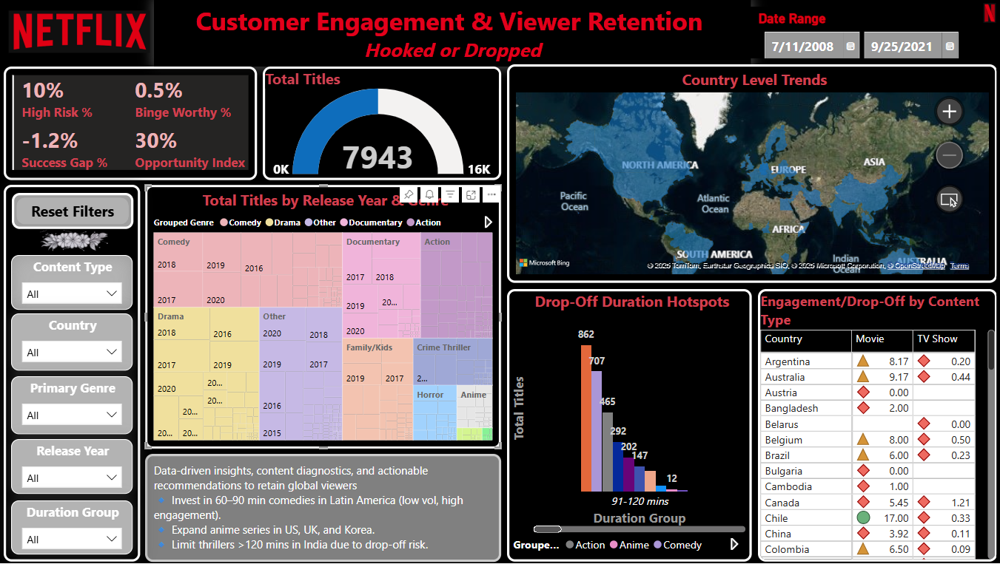

# Netflix Content Engagement & Viewer Retention: Hooked or Dropped

A Power BI storytelling project that explores **viewer engagement patterns, drop-off risks**, and **strategic content opportunities** across Netflix’s global catalog — based on genre, duration, and country trends.

This project merges **data analysis, visual storytelling, and business impact modeling** into an interactive Power BI dashboard and executive PDF report.

---

**Goal:**                                                                                                                                                                           

Discover patterns of viewer engagement, drop-offs, inefficiencies, and make powerful recommendations for Netflix - enabling them to make smarter, more audience-aligned content decisions.

---

**💡Project Objectives:**

- Identify which content types and durations lead to early viewer drop-off.
- Reveal high-engagement content zones across genres and countries.
- Measure production vs. engagement mismatch (Success Gap).
- Recommend where Netflix should invest more (or less) to improve retention.
- Present results through an executive-style dashboard & story-driven reporting.

---

**📊 Dataset:**       

Netflix dataset from Kaggle:                                                                                                                                                                                            
🔗 [Netflix Movies and TV Shows – Kaggle Link] (https://www.kaggle.com/datasets/shivamb/netflix-shows)                                                                                                           

---

## Report Structure & Page-by-Page Overview

**Page 1: Executive Overview (Dashboard Summary)**
- High-level view of total content, type share (% Movies, % TV Shows), and most common genres.
- KPI Cards: High Risk %, Binge Worthy %, Success Gap %, Opportunity Index.
- Slicers panel to dynamically filter by genre, country, release year, etc.

**Page 2: 📉 Drop-Off Risk & Duration Analysis**

📄 Purpose:                                                                                                                                      
Identify patterns where viewers stop watching early, based on:
- Content type
- Duration
- Genre
- Engagement trends

- Analyze drop-off patterns by Duration Group (0-60 mins, 121-240 mins, etc.).
- Highlights underperforming formats and risky engagement patterns
- Detect content categories with high drop-off risk.
- Recommend optimal content duration.
- Spot long vs. short bingeability.

**Page 3: Regional Content & Audience Insights**

📄 Purpose:                                                                                                                 
Show how Netflix content performs across countries/regions, including:
- Top content-producing countries.
- Regional differences in content type or genre.
- Engagement differences by region.
- Localized preferences (e.g., India: TV shows, US: Movies, etc.).

- View content trends and performance by country- Type preferences, genre popularity, average duration.
- Matrix visual showing genre vs country drop-off risk.

**Page 4: Strategic Content Opportunities & Viewer Recommendations**
- Drop-Off Hotspot Chart.
- Opportunity Matrix and Engagement Ratio.
- Strategic Action Summary. 

**Page 5: One-Page Executive Summary Dashboard**
- Compact view of KPIs, visuals, and strategic insight bullets. 

**Page 6: Strategic Storytelling & Business Impact Summary**
- Key insights and business impact modeling.
- Viewer uplift and revenue gain if strategy is adopted.

---

## 🔗 Live Power BI Dashboard

[📊 Click to View the Interactive Dashboard on Power BI Service](https://app.powerbi.com/groups/me/reports/a4f43e83-e8e5-41af-8559-6d2ab45f8669/1b73a65e46b9a9ac5dcc?experience=power-bi)

---

## 📄 PDF Summary Report

Netflix - Customer Engagement & Viewer Retention.pdf
Download it from the GitHub repo: https://github.com/SweetySeelam2/Netflix_Content_Engagement_Viewer_Retention

This 6-page report condenses the key insights, visuals, KPIs, and estimated business impact into an executive-style document.

---

## 📸 Dashboard Preview

---

## 📈 Key Insights

- 🔴 **29% of titles are in high drop-off segments** (e.g., >120 min thrillers, 1-season horrors).
- ✅ **60–90 min short-form comedies in Latin America** show 2–4× higher engagement with low production volume.
- ✅ **Anime in US, UK, and South Korea** shows high retention with low catalog coverage.
- ⚠️ **Crime, Horror, and Documentaries underperform** in some regions: India, Poland, Austria.

---

## 💡 Strategic Recommendations

- ✅ Expand short-form comedies  in Latin America.
- ✅ Invest in anime content in high-retention markets.
- ⚠️ Reduce long thrillers in India & Spain.
- ✅ Scale family/kids content in Southeast Asia.

---

## 💵 Estimated Business Impact (If Adopted)

- 🎯 Viewer Completion by +15–18% improvement.                 
- ⏱️ Viewer Hours Retained by ~2.4 million hours/year globally    .
- 💰 Revenue Opportunity by ~$6–9 million/year via subscription gains.

---

## 🧠 Tools & Technologies

- [Power BI Desktop](https://powerbi.microsoft.com/)
- Power BI Service (Publish to Web)
- PDF report designed in Power BI
- [Netflix Titles Dataset – Kaggle](https://www.kaggle.com/datasets/shivamb/netflix-shows)

---

## 🧾 Files in This Repository

| File/Folder                             			| Description                            |
|--------------------------------------------------------------	|----------------------------------------|
| `Netflix - Customer Engagement & Viewer Retention.pbix`       | Full Power BI report file              |
| `Netflix - Customer Engagement & Viewer Retention.pdf`   	| Executive summary PDF report           |
| `images/dashboard_overview.png`        		 	| Screenshot of main dashboard           |
| `README.md`                             			| Project documentation (this file)      |

---

## 📬 Author

**Sweety Seelam**                                                                                                                                         
🎯 Business Analyst | Aspiring Data Scientist  
📁 [Portfolio Website](https://sweetyseelam2.github.io/SweetySeelam.github.io/)  
🔗 [LinkedIn](https://www.linkedin.com/in/sweetyrao670/)  
💻 [GitHub](https://github.com/SweetySeelam2)

---

## 🏷️ Tags

`Power BI` • `Netflix Analytics` • `Viewer Retention` • `Content Optimization` • `Storytelling with Data` • `Business Intelligence` • `Executive Dashboard` • `Portfolio Project`

---

## License

MIT License     

Copyright (c) 2025 Sweety Seelam  
                                                                                                                    
This project is licensed under the MIT License. You are free to use, modify, and share this work with proper attribution.                                                 
